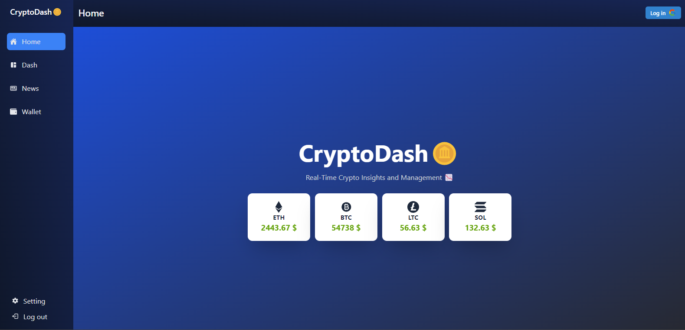
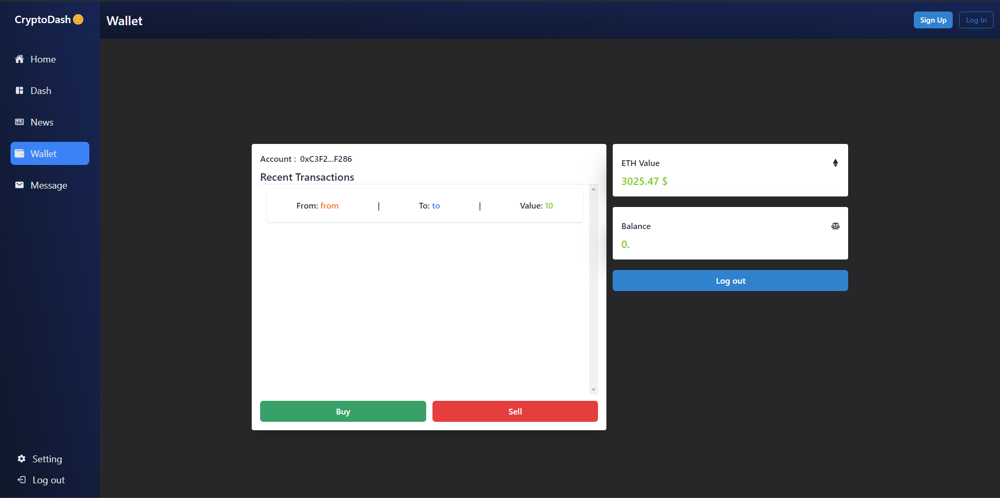

# CryptoDash 🪙

### Introduction

This project is a crypto dashboard that allows you to visualize cryptocurrency data in real-time. I focused on Ethereum for the dashboard section.   

### Features

- **Real-time view of the most popular cryptocurrencies** (ETH, LTC, SOL, BTC) 📊.
- **Integration with [CoinGecko](https://www.coingecko.com/en)** 🌐.
- **Google authentication** to access the Ethereum tracking dashboard, including:
  - Gas price ⛽
  - Ether value 💰
  - Current block 🔗
  - Available Ether ⛓️

- **Wallet integration** (with MetaMask 🦊) to:
  - View your balance 💵
  - Track your transactions 📈
  - Buy or sell Ether 💸

  

### Stack

 
 
 

 

&nbsp;

Also using **Chakra UI** 🌟, which I love for its time-saving features, and **Web3.js** 🛠️ for wallet integration.

### Why a Dashboard?

Blockchain and cryptocurrencies are very intriguing to me, and I have started exploring this world 🔍. I find it to be a fascinating field with a lot of potential 🚀.

It is a field I enjoy, and I aspire to work in the area of dApps and Web3 (frontend/solidity) 💼.

### Contact

- [Website](https://bento.me/etuve) 🌐
- [LinkedIn](https://www.linkedin.com/in/pierrick-bernard-b6bb2b2a7/) 👔
- [Twitter](https://x.com/Etuve_js) 🐦
- bernard.pierrick@gmail.com 📧
